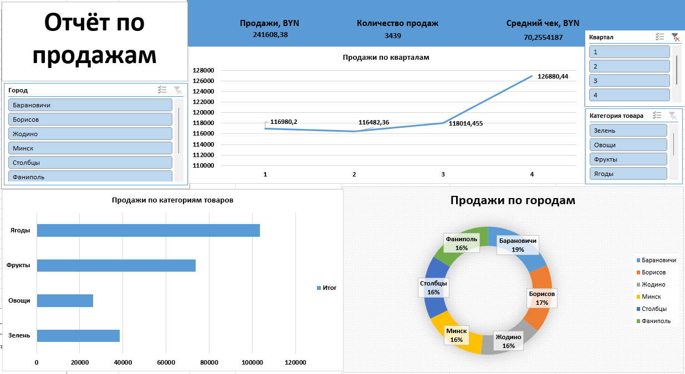

# Sales Database Analysis

This file contains a dashboard and data analysis for a logistics company.

## What's inside

- **Raw data**: Database with product categories, prices, quantities, customers, and delivery dates;
- **Database with filters on all columns**;
- **Dashboard**: Interactive panel with slicers, pivot tables, and a pivot chart.

  ## Preview

## Skills demonstrated

- Pivot tables and charts;
- Slicers for interactive filtering;
- Customizable filtering of large databases;
- Excel dashboards.

---

# Анализ базы данных продаж

Данный файл содержит дашборд и анализ данных для логистической компании.

## Что внутри

- **Исходные данные**: База данных с категориями товаров, их ценами, количеством, заказчиками и датами доставки;
- **База данных с фильтрами по всем столбцам**;
- **Дашборд**: Интерактивная панель со срезами, сводными таблицами и сводной диаграммамой.

  ## Скриншот

## Используемые навыки

- Сводные таблицы и диаграммы;
- Срезы для интерактивной фильтрации;
- Настраиваемая фильтрация больших баз данных;
- Дашборды в Excel.
