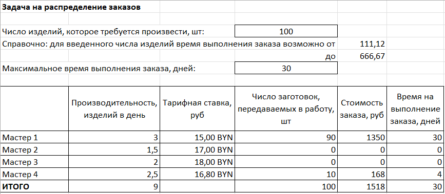
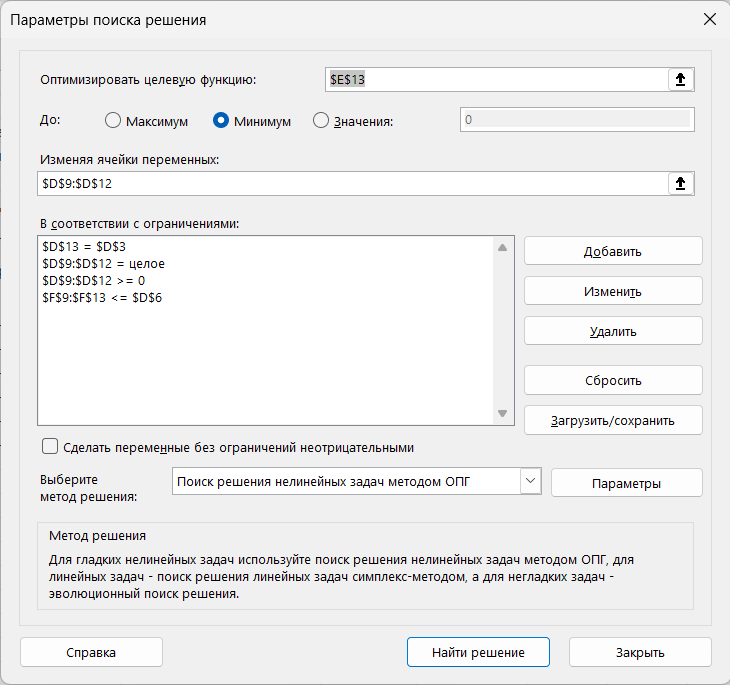
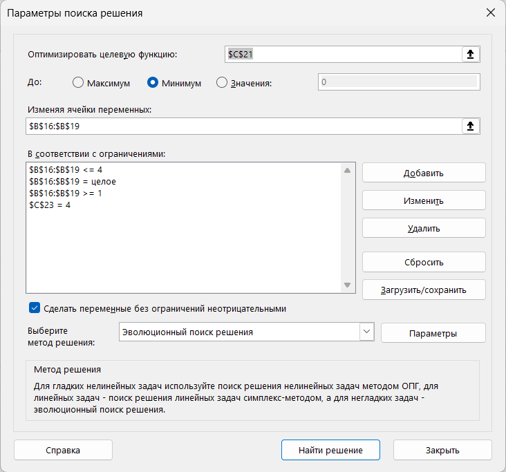

# Solver Optimization

This folder contains two projects solved with Excel Solver.

## Files

- [production-planning.xlsx](./production-planning-solver.xlsx) - An order needs to be distributed between 4 masters. Each master has different productivity and tariff rate. Find the optimal distribution to minimize total time and cost.

**Result**:

**Solver settings**:

---

- [transport-routing.xlsx](./transport-routing.xlsx) - Find the shortest route between cities using their coordinates.

**Result**:

**Solver settings**:

---

## Skills demonstrated

- Optimization with Excel Solver
- Production planning and resource allocation
- Travelling Salesman Problem solving
- Constraint modeling

---

# Оптимизация с помощью Поиска решения

В этой папке два проекта, решённых с помощью надстройки «Поиск решения».

## Файлы

- [production-planning.xlsx](./production-planning-solver.xlsx) - Распределить заказ между 4 мастерами. У каждого мастера разная производительность и тарифная ставка. Найти оптимальное распределение, чтобы минимизировать общее время и стоимость.

**Результат**:

**Настройки Поиска решения**:

---

- [transport-routing.xlsx](./transport-routing.xlsx) - Найти кратчайший маршрут между городами по координатам.

**Результат**:

**Настройки Поиска решения**:

---

## Навыки

- Оптимизация с помощью Поиска решения
- Планирование производства и распределение ресурсов
- Решение задачи коммивояжёра
- Моделирование ограничений
