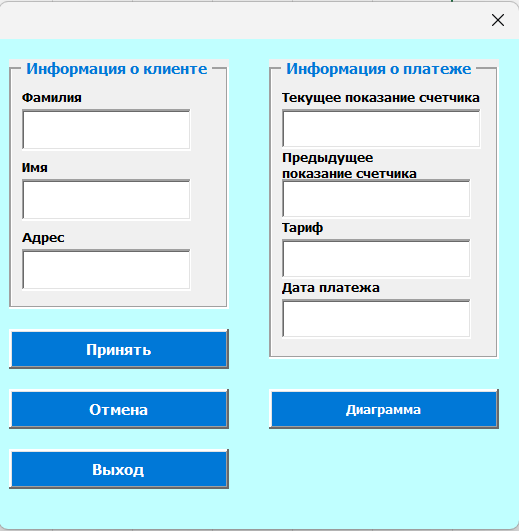
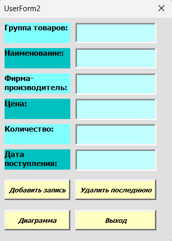

# VBA Projects

This folder contains VBA projects: a simple macro and two full accounting applications with user forms and input validation.

## Files

- [number_format_macro.xlsm](./number_format_macro.xlsm) - Simple macro: applies number format to selected cells
- [electricity_accounting_app.xlsm](./electricity_accounting_app.xlsm) - User form for electricity payments with input validation
- [goods_accounting_app.xlsm](./goods_accounting_app.xlsm) - User form for goods receipt with input validation

---

## Project Overview

Both accounting applications follow the same logic:
- User fills data into a form (fields: customer, date, readings / quantity, price, etc.)
- Data is validated (required fields, data types) - error messages appear if input is incorrect
- Valid data is saved to a database sheet
- A chart is generated automatically from the saved data

The approach works for different business tasks - whether tracking electricity payments or goods receipts. The structure is reusable and can be adapted to any data entry scenario.

---

## Screenshots

### Electricity Payment Form

### Goods Receipt Form

---

## Skills demonstrated

- VBA (macros, UserForms, event-driven automation)
- Input validation (empty fields, data types, error handling with MsgBox)
- Writing data to Excel sheets
- Dynamic chart generation

---

# VBA-проекты

В этой папке собраны VBA-проекты: один простой макрос и два полноценных учётных приложения с пользовательскими формами и валидацией.

## Файлы

- [number_format_macro.xlsm](./number_format_macro.xlsm) - Простой макрос: применяет числовой формат к выделенным ячейкам
- [electricity_accounting_app.xlsm](./electricity_accounting_app.xlsm) - Форма для учёта оплаты за электроэнергию с валидацией
- [goods_accounting_app.xlsm](./goods_accounting_app.xlsm) - Форма для учёта поступления товаров с валидацией

---

## О проектах

Оба приложения работают по одной схеме:
- Пользователь заполняет форму (поля: клиент, дата, показания / количество, цена и т.д.)
- Данные проходят проверку (обязательные поля, типы данных) - при ошибке появляется сообщение
- Корректные данные сохраняются в базу на листе Excel
- По сохранённым данным автоматически строится диаграмма

Подход работает для разных бизнес-задач - будь то учёт электроэнергии или поступление товаров. Структура переиспользуема и может быть адаптирована под любой сценарий ввода данных.

---

## Скриншоты форм

### Форма учёта электроэнергии

### Форма учёта товаров

---

## Навыки

- VBA (макросы, пользовательские формы, событийная автоматизация)
- Валидация данных (проверка заполнения, типов данных, обработка ошибок через MsgBox)
- Запись данных в Excel
- Автоматическое построение диаграмм
